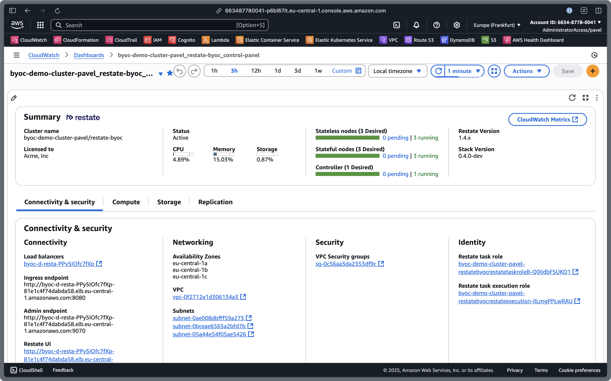
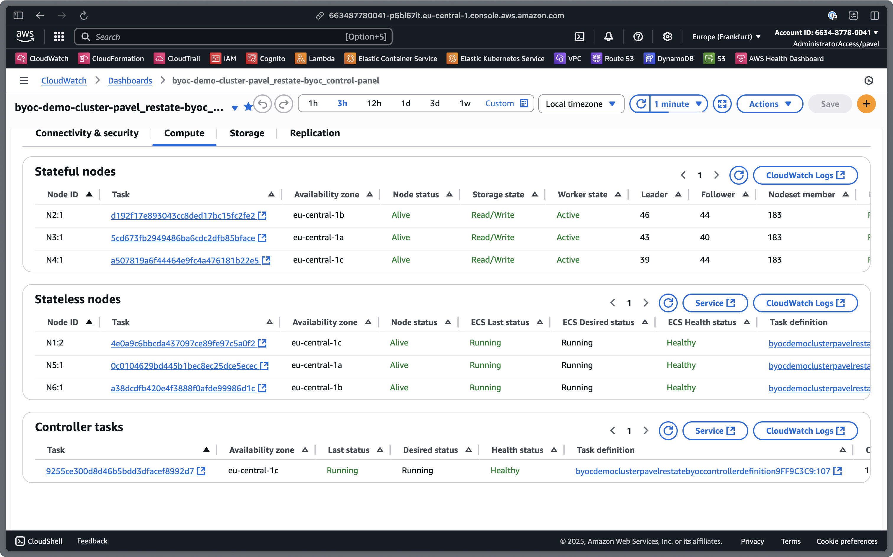
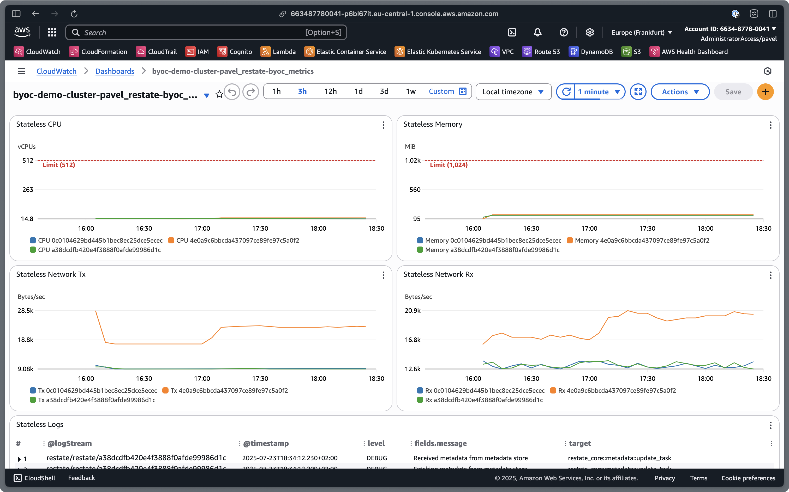
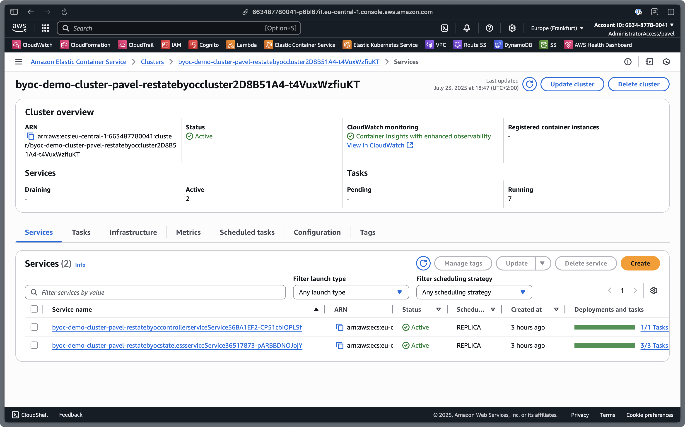
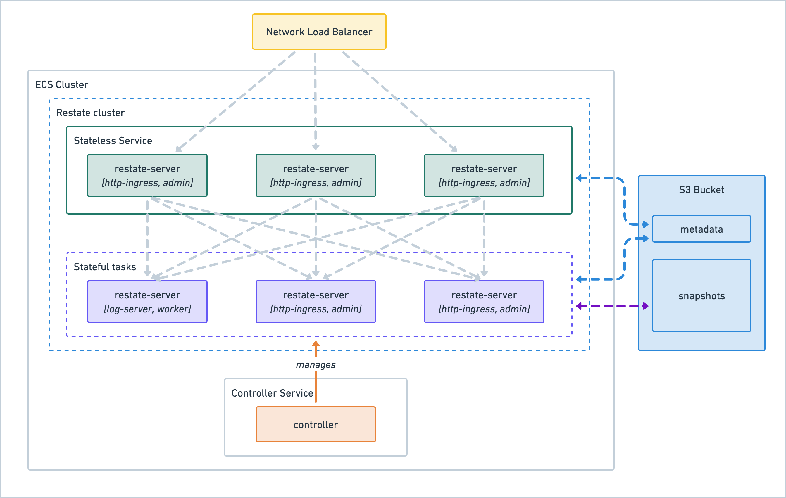

# Restate BYOC

Restate "Bring Your Own Cloud" provides deployment blueprints for Restate clusters running on customer-owned cloud infrastructure. These clusters provide a production-grade durable computing solution with low operational overhead.

At present, the only supported deployment target is AWS ECS backed by Fargate compute. A custom task life cycle controller allows stateful Restate nodes to safely run on Fargate capacity.

This document outlines the typical getting-started process for new deployments, as well as an overview of how Restate, the deployment controller, and various AWS components work together.

# Getting started

Restate BYOC is designed for an infrastructure-as-code deployment model and supports [AWS Cloud Development Kit](https://docs.aws.amazon.com/cdk/v2/guide/home.html) (CDK). Typical life cycle updates such as version upgrades, Restate configuration changes, or cluster size adjustments are performed by updating and deploying CDK infrastructure code. Restate CDK also supports managing Lambda-based service deployments via CDK, providing a unified developer experience for both infrastructure and application management.

## Prerequisites for deploying a Restate cluster

This guide assumes basic familiarity with AWS CDK, and access to an AWS account. Example code contains self-contained CDK stacks that can be deployed as standalone examples. It is expected that some customization will be required to fit in with your particular environment.

## Using AWS CDK and the Restate cluster construct

The Restate BYOC construct for CDK is available as [`@restatedev/byoc`](https://www.npmjs.com/package/@restatedev/byoc). Install the package in a new or existing CDK TypeScript project. The entry point to create an ECS Fargate cluster is the construct `RestateEcsFargateCluster`. A minimal CDK stack containing a Restate BYOC construct would look like this:

```ts
export class RestateStack extends cdk.Stack {
  constructor(scope: Construct, id: string, props?: cdk.StackProps) {
    super(scope, id, props);

    const vpc = new cdk.aws_ec2.Vpc(this, "vpc", {
      maxAzs: 3,
    });

    const cluster = new RestateEcsFargateCluster(this, "restate-byoc", {
      licenseKey: "this-was-provided-to-you-by-restate",
      vpc,
    });
  }
}
```

The `RestateEcsFargateCluster` construct creates all the necessary infrastructure for a 6-node Restate cluster spread across three availability zones. The default replication is `{ zone: 2 }` which means that a consensus across two AZs is required. This implies that the provided VPC must have three private subnets available. (An exhaustive list of all defaults and configuration properties is available in _Appendix A_.)

The default deployment creates an owned S3 bucket which will be used for metadata and snapshot storage. You can connect the cluster to an existing bucket (and optionally specify a prefix) as follows:

```ts
const cluster = new RestateEcsFargateCluster(this, "restate-byoc", {
  licenseKey: "this-was-provided-to-you-by-restate",
  vpc,
  objectStorage: {
    bucket: aws_s3.Bucket.fromBucketName(
      this,
      "restate-bucket",
      "existing-bucket-name",
    ),
    // prefix: "path/in/bucket"
  },
});
```

You can also customize the resources provisioned for the Restate nodes:

```ts
const cluster = new RestateEcsFargateCluster(this, "restate-byoc", {
  licenseKey: "this-was-provided-to-you-by-restate",
  vpc,
  statelessNode: {
    resources: {
      cpu: 16384,
      memoryLimitMiB: 32768,
    },
    defaultReplication: { zone: 2 },
    defaultPartitions: 128,
  },
  statefulNode: {
    resources: {
      cpu: 16384,
      memoryLimitMiB: 32768,
    },
  },
});
```

Deploy the CDK stack as appropriate to your development/test environment using `cdk deploy` or the usual process you follow.

You can use output parameters to connect various generated properties such as the ingress endpoint URL to where they are needed.

```ts
new cdk.CfnOutput(this, "ingressEndpointUrl", {
  value: `${restate.listeners.ingress.protocol}://${restate.listeners.ingress.lb.loadBalancerDnsName}:${restate.listeners.ingress.port}`,
});
new cdk.CfnOutput(this, "adminEndpointUrl", {
  value: `${restate.listeners.admin.protocol}://${restate.listeners.admin.lb.loadBalancerDnsName}:${restate.listeners.admin.port}`,
});
new cdk.CfnOutput(this, "dashboardName", {
  value: restate.monitoring.controlPanelDashboard?.dashboardName ?? "-",
});
```

On successful deployment, the stack outputs will show the cluster's ingress and admin URLs, and CloudWatch dashboard name.

## Deploying services

The [`@restatedev/restate-cdk`](https://www.npmjs.com/package/@restatedev/restate-cdk) library provides a `ServiceDeployer` construct which you can use to register Lambda functions in your BYOC cluster. This is documented in the [Restate CDK Documentation](https://docs.restate.dev/deploy/lambda/cdk).

The BYOC cluster implements `IRestateEnvironment` from the CDK library, so it can be used as the target for a deployer.
However, the implementation uses the admin URL of the construct-managed load balancer, which defaults to an internal NLB.
Therefore the deployer should be placed in the same VPC and security groups so that it has network access to the admin URL.

```ts
// create a Restate nodejs service
const service = new NodejsFunction(this, "service", {
  runtime: lambda.Runtime.NODEJS_LATEST,
  architecture: lambda.Architecture.ARM_64,
  entry: "handler", // use the path to your service handler
});

// create a Restate cluster
const cluster = new RestateEcsFargateCluster(this, "cluster", {
  licenseKey,
  vpc,
  ...,
});
// give the cluster permissions to invoke your lambda
service.grantInvoke(cluster)

// create a service deployer that is in the cluster vpc
const deployer = new restate.ServiceDeployer(this, "deployer", {
  vpc: cluster.vpc,
  vpcSubnets: cluster.vpcSubnets,
  securityGroups: cluster.securityGroups,
});

// register the current version of the service with restate
deployer.register(service.currentVersion, cluster);
```

If you manage application stacks separately from the Restate cluster infrastructure stack, e.g. because these are owned by separate platform and development teams, you can also use the admin URL produced by the cluster stack when constructing the `ServiceDeployer`. Additionally, in a more federated setup you may want to create a dedicated invoker role which can be assumed by the cluster. This will be used by Restate to perform the Lambda function invocations to specific services.

```ts
// create a Restate nodejs service
const service = new NodejsFunction(this, "service", {
  runtime: lambda.Runtime.NODEJS_LATEST,
  architecture: lambda.Architecture.ARM_64,
  entry: "handler", // use the path to your service handler
});

// create a dedicated invoker role for Restate to call _this_ specific application
const invokerRole = new Role(this, "restate-invoker-role", {
  assumedBy: props.restateRole,
});

// we can construct the cluster environment just from its admin URL
const cluster = restate.RestateEnvironment.fromAttributes({
  adminUrl: props.adminUrl,
  invokerRole,
});

// the deployer still needs access to the Restate cluster's VPC and security groups
const deployer = new restate.ServiceDeployer(this, "deployer", {
  vpc: props.vpc,
  vpcSubnets: props.vpcSubnets,
  securityGroups: props.securityGroups,
});
deployer.register(service.currentVersion, cluster);
```

## Monitoring

When you first navigate to the Restate control panel dashboard in CloudWatch, you will see the following warning:

> This dashboard contains custom widgets that will invoke Lambda functions.

This is expected; you should allow invoking custom Lambda functions to continue.

You can view the BYOC stack resources in a variety of ways; Restate BYOC creates two custom dashboards as part of the deployment which present a Restate-specific view of the cluster.

**CloudWatch dashboards**

The Restate BYOC cluster custom dashboards can be found in the AWS CloudWatch console, under “Dashboards”

**Restate Control Panel**

The Restate Control Panel is the main graphical view of the cluster — the various tabs provide perspectives similar to the detailed tables rendered by `restatectl nodes` / `partitions` / `logs`.



The compute tab provides a useful view of the ECS tasks and their Restate node ids, and the state of the BYOC deployment controller task. During deployments or task updates you can see how the node responsibilities change from here.

The "Service" links next to Stateless and Controller tasks will take you to the ECS view of those services. Note that the Stateful tasks are not part of a service, as they are managed by the Restate deployment controller — they only exist in ECS as individual tasks. The CloudWatch Logs links will take you to the respective log groups.



**Restate Metrics**

The _CloudWatch Metrics_ link on the dashboard will take you to a custom Restate Metrics dashboard showing key operational metrics and the logs of the three cluster components.



**ECS Console**

In addition to the Restate-provided Control Panel and Metrics dashboards, the ECS console provides a deeper view into the operational details. This provides another view into the tasks and metrics of the clusters, though bear in mind that at this point nothing is Restate-aware. Generally avoid changing settings from here — any adjustments should be performed in CDK code and deployed using the normal `cdk deploy` mechanism.



**Viewing logs**

The logs for your cluster are split into log groups for stateless, stateful, and controller tasks.

## Using operational tools (`restate`, `restatectl`)

The Restate UI can be accessed at the admin endpoint URL, on the 9070 service port. You can use AWS's ALB features to set up [user authentication](authentication.md). The same URL can also be used with `restate` to manage services from the command line:

```sh
RESTATE_HOST="lb-name.region.amazonaws.com" restate services list
```

You can store this as a separate environment in your local configuration using `restate config edit`.

### Lambda-based `restatectl` wrapper

By default the cluster construct deploys the [`restatectl` tool](https://docs.restate.dev/operate/clusters/#controlling-clusters-with-restatectl) as a Lambda function, which has direct access to the tasks/nodes. An example wrapper script that allows you to run commands via this mechanism is available in [`restatectl.sh`](../scripts/restatectl.sh).

### Execute directly commands on tasks

> ⚠️ The cluster must be deployed with `enableExecuteCommand` enabled for this approach to work!

You can get a basic shell on any stateless or stateful task with the AWS CLI. You need:

- the ECS cluster name and a valid task ID (see Control Panel dashboard above)
- to be authenticated for AWS identity in the correct account and region, and have permission to perform `ecs:ExecuteCommand`

```sh
aws ecs execute-command \
	--region [AWS-REGION] \
	--cluster [CLUSTER-NAME]  \
	--container restate \
	--interactive \
	--task [TASK-ID] \
	--command "/bin/bash"
```

From here, you can execute tools like `restate` and `restatectl`, which are bundled in the `restate-server` container image.

# Cluster architecture



The default Restate cluster topology is to deploy two sets of 3 nodes across 3 Availability Zones (AZs). AZs are distinct failure domains within an AWS region with separate power and network infra, approximately equivalent to data centers.

**Deployment controller:** Fargate deployment controller deployed as an ECS Service (single copy of a task running the container); when the task is running, it uses the ECS API to manage the desired number of stateful nodes. ECS maintains a copy (typically one) of this task.

**Stateless layer:** Restate server running `admin` + `http-ingress` roles, deployed as an ECS-managed Service. ECS ensures that the desired number of copies of this task are running.

**Stateful layer:** Restate server running `log-server` + `worker` roles, running as individual tasks as they are managed by the deployment controller.

The Restate BYOC construct creates an Amazon Network Load Balancer (NLB) which provides L4 / TCP load balancing with default listeners for ports 8080, 9070, and 5122.

## Deployment Controller

The Restate controller is a separate service that manages the life cycle of stateful nodes. It is responsible for safely draining outdated stateful nodes when they need to be replaced, for example during a CDK deployment that updates the Restate version or other configuration aspects.

# Known Issues

The following is a list of known issues with the Restate BYOC cluster construct as of July 2025.

## Restate CDK library compatibility

Please use `@restatedev/restate-cdk` version `0.0.0-SNAPSHOT-20250521082206`; the latest released version is not yet compatible with `@restatedev/byoc`.

## Delete cluster fails

Deleting a CDK/CloudFormation stack containing a Restate cluster may fail as the task controller is destroyed before the stateful tasks. To resolve, open the ECS cluster in the AWS ECS console, navigate to "Tasks", select all the remaining running tasks, and click on "Stop" -> "Stop Selected". Automatic cleanup will be included in a future release of the BYOC cluster construct.

# Appendix A: RestateEcsFargateCluster construct reference

```ts
import * as cdk from "aws-cdk-lib";
import { Construct } from "constructs";

export class RestateExampleStack extends cdk.Stack {
  constructor(scope: Construct, id: string, props?: cdk.StackProps) {
    super(scope, id, props);

    // This is a stub, depending on your requirements you could reference an existing VPC.
    const vpc = new cdk.aws_ec2.Vpc(this, "Vpc", {
      maxAzs: 3,
      natGateways: 3,
    });

    // Default configuration for RestateBYOC.
    const restateConfig = {
      licenseKey: "your-license-id", // REQUIRED
      vpc: vpc, // REQUIRED
      clusterName: "restate-cluster", // derived from construct name
      subnets: { subnetType: cdk.aws_ec2.SubnetType.PRIVATE_WITH_EGRESS },
      ecsCluster: new cdk.aws_ecs.Cluster(this, "Cluster"),
      securityGroups: [
        new cdk.aws_ec2.SecurityGroup(this, "SecurityGroup", { vpc: vpc }),
      ], // auto-created with internal port access
      objectStorage: {
        bucket: new cdk.aws_s3.Bucket(this, "Bucket"), // auto-created
        prefix: "", // bucket root
      },
      loadBalancer: {
        shared: {
          // auto-created internal NLB
          nlbProps: {
            vpc: vpc, // derived from vpc prop
            internetFacing: false,
            vpcSubnets: {
              subnetType: cdk.aws_ec2.SubnetType.PRIVATE_WITH_EGRESS,
            }, // derived from subnets prop
          },
        },
        createAlbTargets: false,
      },
      addresses: {
        // auto-created and derived from load balancer
        ingress: "internal-nlb-address:8080", // derived from load balancer
        admin: "internal-nlb-address:9070", // derived from load balancer
        webUI: "internal-nlb-address:8080", // derived from load balancer
      },
      statelessNode: {
        desiredCount: 3,
        resources: {
          cpu: 16384,
          memoryLimitMiB: 32768,
        },
        defaultReplication: { zone: 2 },
        defaultPartitions: 128,
        ingressAdvertisedAddress: "internal-nlb-address:8080", // derived from load balancer
        restateImage: "docker.restate.dev/restatedev/restate:1.4",
        restateVersion: "1.4", // derived from restateImage,
        environment: {},
      },
      statefulNode: {
        nodesPerAz: 1,
        resources: {
          cpu: 16384,
          memoryLimitMiB: 32768,
        },
        restateImage: "docker.restate.dev/restatedev/restate:1.4",
        restateVersion: "1.4", // derived from restateImage
        environment: {},
      },
      controller: {
        controllerImage:
          "docker.restate.dev/restatedev/restate-fargate-controller:0.2",
        resources: {
          cpu: 1024,
          memoryLimitMiB: 2048,
        },
        snapshotRetention: {
          disabled: false,
          duration: cdk.Duration.hours(24),
        },
        tasks: {
          executionRole: new cdk.aws_iam.Role(this, "ControllerExecutionRole", {
            assumedBy: new cdk.aws_iam.ServicePrincipal(
              "ecs-tasks.amazonaws.com",
            ),
          }), // auto-created
          taskRole: new cdk.aws_iam.Role(this, "ControllerTaskRole", {
            assumedBy: new cdk.aws_iam.ServicePrincipal(
              "ecs-tasks.amazonaws.com",
            ),
          }), // auto-created
          logDriver: cdk.aws_ecs.LogDrivers.awsLogs({
            streamPrefix: "controller",
          }), // auto-created
          enableExecuteCommand: false,
          cpuArchitecture: cdk.aws_ecs.CpuArchitecture.ARM64,
        },
      },
      restateTasks: {
        executionRole: new cdk.aws_iam.Role(this, "RestateExecutionRole", {
          assumedBy: new cdk.aws_iam.ServicePrincipal(
            "ecs-tasks.amazonaws.com",
          ),
        }), // auto-created
        taskRole: new cdk.aws_iam.Role(this, "RestateTaskRole", {
          assumedBy: new cdk.aws_iam.ServicePrincipal(
            "ecs-tasks.amazonaws.com",
          ),
        }), // auto-created
        logDriver: cdk.aws_ecs.LogDrivers.awsLogs({ streamPrefix: "restate" }), // auto-created
        enableExecuteCommand: false,
        cpuArchitecture: cdk.aws_ecs.CpuArchitecture.ARM64,
      },
      restatectl: {
        disabled: false,
        executionRole: new cdk.aws_iam.Role(this, "RestatectlRole", {
          assumedBy: new cdk.aws_iam.ServicePrincipal("lambda.amazonaws.com"),
        }), // auto-created
      },
      retirementWatcher: {
        disabled: false,
        executionRole: new cdk.aws_iam.Role(this, "RetirementWatcherRole", {
          assumedBy: new cdk.aws_iam.ServicePrincipal("lambda.amazonaws.com"),
        }), // auto-created
      },
      monitoring: {
        dashboard: {
          metrics: {
            disabled: false,
            autogeneratedName: false,
          },
          controlPanel: {
            disabled: false,
            autogeneratedName: false,
          },
          customWidgets: {
            disabled: false,
            executionRole: new cdk.aws_iam.Role(this, "CustomWidgetsRole", {
              assumedBy: new cdk.aws_iam.ServicePrincipal(
                "lambda.amazonaws.com",
              ),
            }), // auto-created
          },
        },
      },
    };

    const restateCluster = new RestateEcsFargateCluster(this, "RestateCluster", restateConfig);
  }
}
```
